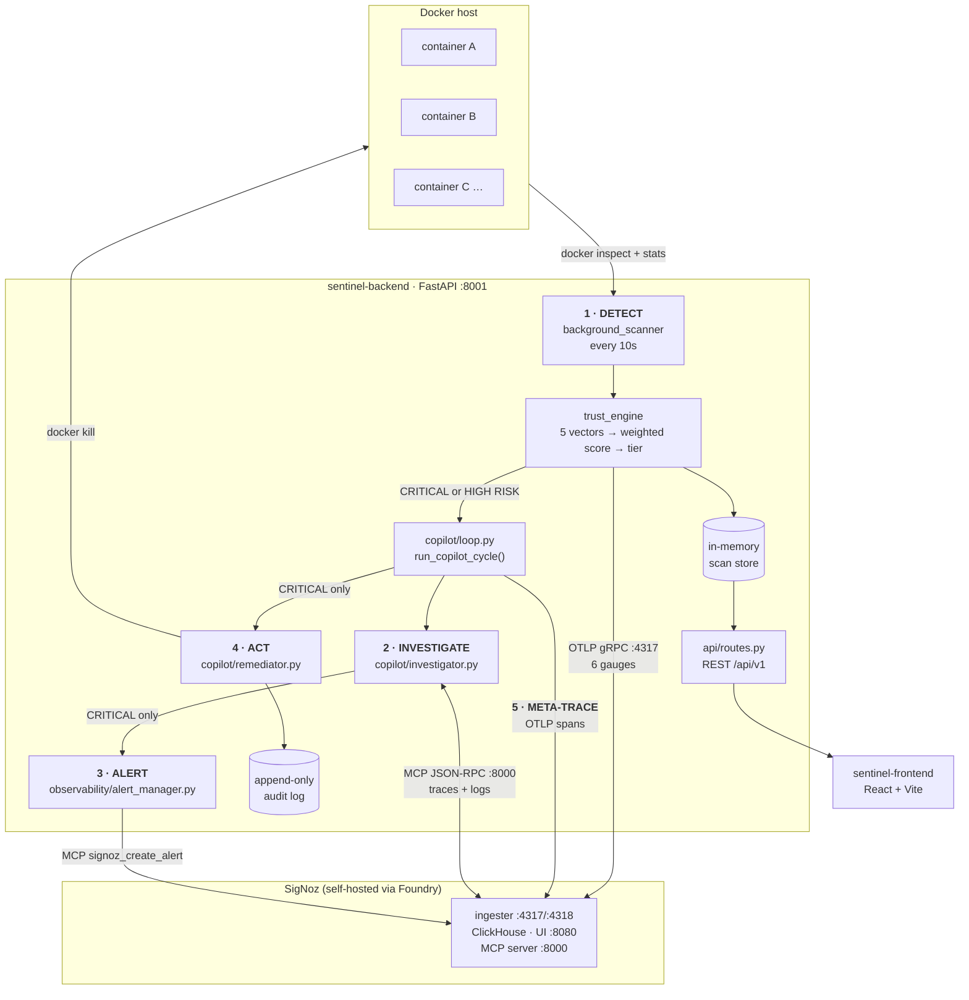

# Sentinel Copilot

**An autonomous SRE agent for Shadow AI governance, built on SigNoz.**

Sentinel Copilot continuously scores every container on a host against five trust vectors,
investigates the ones that score badly using real telemetry from SigNoz, writes a standing
alert rule so the same condition is caught next time, and — only in the worst tier — kills
the container on its own. Then it traces its own decision-making back into SigNoz, so you
can watch the agent think.

Built for the **Agents of SigNoz** hackathon (WeMakeDevs).

---

## The problem: Shadow AI

Running an AI agent takes one command. `docker run` some image off a registry, hand it an
API key, point it at your infrastructure. No procurement, no review, no ticket.

The result is a fleet nobody has an inventory of:

- **Unknown provenance.** Is that image the vendor's, a fork, or someone's `latest` build?
- **Over-privileged by default.** Containers run as root unless told otherwise. `--privileged`
  is a common "just make it work" fix that hands over the host.
- **Reachable from anywhere.** `-p 2375:2375` publishes the Docker API to `0.0.0.0`. So does
  a forgotten debug port.
- **Unbounded.** No memory limit means one runaway agent loop can OOM its neighbours.
- **Unmetered reasoning.** An agent that retries in a loop burns tokens with no ceiling and
  no owner watching the bill.

Observability tooling already tells you *what* is running. The gap is that a dashboard has
no opinion and takes no action — somebody still has to notice the red panel, work out which
of a dozen findings actually matters, and decide what to do at 3am.

Sentinel Copilot closes that loop. It scores, decides, acts, and shows its work.

---

## The loop



**Detect** → every container scored every 10s. **Investigate** → the lowest-scoring vector
becomes the root cause, corroborated with SigNoz traces and logs. **Alert** → a threshold
rule is created in SigNoz for CRITICAL containers. **Act** → CRITICAL containers are killed
autonomously, and every decision (including skips) is audited. **Meta-trace** → the whole
cycle is emitted as an OTel span tree, so the agent's own reasoning is observable in the
same tool it uses to observe everything else.

Full walkthrough with real payloads: [docs/ARCHITECTURE.md](docs/ARCHITECTURE.md).

---

## How SigNoz is used

SigNoz is not a metrics sink bolted on at the end — it is the agent's sensory system, its
notebook, and its output channel. Six distinct integration points:

| Surface | How Sentinel uses it |
|---|---|
| **OTLP metrics** (gRPC `:4317`) | Six observable gauges, 0–100. Every container's trust score plus each of its five vectors, attributed with `container_id`, `container_name`, `environment` and `risk_tier` |
| **OTLP traces** | The agent instruments *itself*. Each cycle is a `copilot_cycle` span with `detect` / `investigate` / `remediate` children, tagged `component = sentinel-copilot-brain` |
| **MCP — reading telemetry** | The Investigator calls `signoz_search_traces` and `signoz_search_logs` to attach real evidence to a finding instead of guessing |
| **MCP — LLM behaviour** | The `llm_behavior` vector queries SigNoz for GenAI-convention spans (`gen_ai.*`, `llm.chat.completion`, …) to score agent reasoning cost and latency |
| **MCP — writing alerts** | On CRITICAL, the agent calls `signoz_list_notification_channels` then `signoz_create_alert` to leave a standing detection behind. It looks the channel up rather than hardcoding a name |
| **Dashboards as code** | Two dashboards built with the SigNoz query builder and exported to JSON: [docs/signoz-dashboards/](docs/signoz-dashboards/) |

Deployment uses SigNoz's own Foundry tooling via [casting.yaml](casting.yaml) — which is also
what enables the MCP server. Verified against **SigNoz v0.134.0**.

---

## The trust engine

Five vectors, each 0–100, combined into one weighted score.

| Vector | Weight | What drops the score |
|---|---|---|
| `identity` | 0.25 | Image not in the sanctioned whitelist → **20**. Digest-only image, no verifiable tag → **10** |
| `configuration` | 0.25 | Running as root −25, `--privileged` −40, read-only rootfs **+15** |
| `network` | 0.15 | Port published on `0.0.0.0` −15, or −25 if it is a critical port (22, 23, 2375, 2376, 3306, 5432, 6379, 27017). Loopback-only bindings are free |
| `resources` | 0.15 | No memory limit −20, no CPU limit −15, CPU >80% −20, memory >80% −20 |
| `llm_behavior` | 0.20 | Derived from LLM telemetry in SigNoz: high estimated cost −30, high latency −20, low token use +10. Returns a neutral **100** when no LLM telemetry exists |

| Tier | Score | What the agent does |
|---|---|---|
| `CRITICAL` | < 40 | Investigate → create alert → **autonomous kill** |
| `HIGH RISK` | 40 – 60 | Investigate only. Never killed |
| `ELEVATED` | 60 – 80 | Score and expose. No action |
| `HEALTHY` | ≥ 80 | Score and expose. No action |

Two deliberate safety properties: the kill path is gated twice (the loop won't call the
Remediator outside CRITICAL, and the Remediator re-checks the tier before touching Docker),
and **skips are audited exactly like kills** — a decision not to act is as reviewable as a
decision to act.

---

## Quick start

Prerequisites: Docker, Python 3.12+, Node 18+. Roughly 10 minutes, mostly image pulls.

### 1 · Start SigNoz via Foundry

```bash
curl -fsSL https://signoz.io/foundry.sh | bash     # installs foundryctl to ~/.local/bin
~/.local/bin/foundryctl cast -f casting.yaml
```

That brings up the UI on **:8080**, OTLP ingest on **:4317 / :4318**, and — because
`casting.yaml` sets `mcp.spec.enabled: true` — the **MCP server on :8000**.

```bash
curl -s http://localhost:8080/api/v1/version     # wait for this to answer
```

> Image pulls can fail with a TLS handshake timeout on a slow link. Re-run `foundryctl cast`
> — completed layers are cached, so each attempt makes progress.

### 2 · Create an account and an API key

```bash
curl -X POST http://localhost:8080/api/v1/register \
  -H 'Content-Type: application/json' \
  -d '{"name":"Admin","orgName":"Sentinel","email":"admin@sentinel.local","password":"<password>"}'
```

Then in the UI: **Settings → Service Accounts →** create one with role `signoz-admin` **→
add key**, and copy it.

### 3 · Run the backend

```bash
cd sentinel-backend
cp .env.example .env          # then set SIGNOZ_API_KEY=<the key from step 2>
python3 -m venv .venv && ./.venv/bin/pip install -r requirements.txt
./.venv/bin/uvicorn app.main:app --host 0.0.0.0 --port 8001
```

> **`SIGNOZ_API_KEY` is required, not optional.** Without it the MCP client refuses to
> construct, `loop.py` catches the error, and the cycle still reports
> `final_action: investigated_no_kill` — so investigation and alerting silently do nothing
> while appearing to have worked. If investigations come back with no evidence, check this
> first.

### 4 · Seed a demo fleet

```bash
./scripts/seed_demo_agents.sh          # four containers with different risk profiles
./scripts/seed_demo_agents.sh verify   # print each one's score and vector breakdown
```

Verified spread:

```
sentinel-demo-clean        100.00  HEALTHY     id=100 cfg=100 net=100 res=100 llm=100
sentinel-demo-unbounded     68.50  ELEVATED    id=20  cfg=75  net=100 res=65  llm=100
sentinel-demo-exposed       64.00  ELEVATED    id=20  cfg=75  net=35  res=100 llm=100
sentinel-demo-privileged    43.50  HIGH RISK   id=20  cfg=35  net=0   res=65  llm=100
```

`./scripts/seed_demo_agents.sh down` removes them again.

### 5 · Run the frontend

```bash
cd sentinel-frontend
cp .env.example .env      # VITE_API_URL=http://localhost:8001/api/v1
npm install && npm run dev
```

### 6 · Import the dashboards

SigNoz UI → **Dashboards → New dashboard → Import JSON**, once for each file in
[docs/signoz-dashboards/](docs/signoz-dashboards/).

### Ports

| Port | Service |
|---|---|
| 8001 | Sentinel backend (FastAPI) |
| 8080 | SigNoz UI + API |
| 4317 / 4318 | SigNoz OTLP ingest (gRPC / HTTP) |
| 8000 | SigNoz **MCP server** — not the backend |
| 5173 | Frontend dev server (Vite) |

---

## Dashboards

Both are committed as importable JSON in [docs/signoz-dashboards/](docs/signoz-dashboards/),
built with the SigNoz v5 query builder against the gauges the backend actually emits.

**Executive Overview** — fleet trust score, container count by `risk_tier`, current score
per trust vector, and trust score over time per container.

**Cost Intelligence** — governance-risk framing: unsanctioned containers, containers with no
resource limits, network exposure, and LLM-behaviour coverage.

> **No screenshots are committed yet.** Capturing them needs a browser session against a
> running stack, which could not be automated in the environment this was developed in
> (headless Chrome would not load `http://` targets). Rather than ship a mock-up, the panels
> are described above and the JSON is committed so anyone can reproduce them exactly. To
> capture: import both dashboards, set the range to **Last 30 minutes** with a seeded fleet,
> and save as `docs/signoz-dashboards/executive-overview.png` and `cost-intelligence.png`.

**On honesty in the panels.** The Cost Intelligence dashboard deliberately contains **no
cost-per-day panel**, because no cost metric is measured anywhere in this system. Panels
report governance risk, which is real, rather than dollars, which would be invented. See
[docs/signoz-dashboards/README.md](docs/signoz-dashboards/README.md).

---

## Tests

```bash
cd sentinel-backend
./.venv/bin/python -m pytest        # 212 passing
```

| File | Tests | Covers |
|---|---|---|
| `tests/test_trust_vectors.py` | 88 | All five vectors: exact arithmetic, boundaries, clamping, malformed Docker payloads |
| `tests/test_api_routes.py` | 48 | Every `/api/v1` route, including the 404 / 503 / 500 error paths |
| `tests/test_scorer.py` | 29 | Weights, tier boundaries, weight redistribution, fail-closed behaviour |
| `tests/test_trust_engine.py` | 16 | Earlier smoke coverage of the vectors and scorer |
| `tests/test_api_and_mcp.py` | 15 | Route smoke tests plus the MCP client's JSON-RPC handling |
| `tests/test_loop_and_remediator.py` | 11 | Cycle orchestration and the kill gate |
| `tests/test_investigator_and_alerts.py` | 5 | Investigation and alert creation |

The vector, scorer and route suites are hermetic — no Docker socket, no SigNoz, no network.
Docker payloads are hand-built to match the real API shape, and the three places a route
reaches outside itself (`kill_container`, `Investigator`, `run_copilot_cycle`) are patched,
which is the only way the error paths get exercised at all.

Two things worth knowing about the suite:

- `test_scorer.py::TestVerifiedFleetProfiles` pins the five vector sets and totals observed
  on a **real** Docker host, including the 38.00 that triggered a real autonomous kill. They
  are regression locks, not derivations — if a weight changes, they fail.
- `test_trust_vectors.py::test_registry_prefix_spoofing_is_not_caught` documents a genuine
  gap rather than hiding it: the identity whitelist retries each pattern against the last
  path segment, so `evil.example.com/nginx:latest` currently scores a trusted 100. The test
  asserts today's behaviour and says so in its docstring.

---

## API

All routes under `/api/v1`:

| Endpoint | Purpose |
|---|---|
| `GET /containers` | Every scanned container with vector scores and reasons |
| `GET /containers/{id}` | One container's full breakdown |
| `GET /containers/{id}/investigation` | Run an Investigator pass on demand |
| `POST /containers/{id}/run-copilot-cycle` | Run the whole cycle on demand — the demo trigger |
| `POST /containers/{id}/kill` | Manual kill switch, independent of the autonomous path |
| `GET /metrics/summary`, `/metrics/cost` | Executive and cost aggregates |
| `GET /discovery/shadow-ai` | Container discovery, shaped for the frontend |
| `GET /security/alerts` | Alerts derived from CRITICAL / HIGH RISK containers |
| `GET /governance/audit-logs` | Remediator audit trail, including skips |
| `GET /system/health` | Fleet health summary |

Interactive docs at `http://localhost:8001/docs` once the backend is running.

---

## What this does not do

A governance tool that overstates itself is worse than useless, so:

- **Cost figures are not measured.** `/metrics/cost` and `money_saved` come from a hardcoded
  `$300/container` model in `routes.py`. They are marked "Demo Data" in the UI and must not
  be quoted as savings.
- **`llm_behavior: 100` means "not measured", not "well behaved."** With no LLM telemetry the
  vector returns a neutral 100 by design, so it never penalises non-LLM containers.
- **Nothing is persisted.** The scan store and audit log live in memory; a backend restart
  clears all history. Only what reached SigNoz survives.
- **CRITICAL is hard to reach by misconfiguration alone.** Because `llm_behavior`'s neutral
  100 contributes a fixed 20 points, even privileged + root + four exposed critical ports
  lands around 43. Reaching CRITICAL needs a digest-only image plus sustained resource abuse.
- **Scanning is serial**, roughly 2s of Docker I/O per container. Fine for a demo fleet, not
  for a large one.
- **Authentication is mocked.** The frontend's SSO is a stub; there is no auth backend.

---

## Repository layout

```
sentinel-backend/app/
  api/routes.py              REST API
  core/                      config, docker_bridge
  trust_engine/
    vectors/                 identity, configuration, network, resources, llm_behavior
    scorer.py                weights + tier thresholds
  scanner/background_scanner.py
  copilot/                   loop, investigator, remediator
  observability/             otel_setup, metrics_emitter, copilot_tracer,
                             alert_manager, mcp_client
sentinel-backend/tests/      pytest suite
sentinel-frontend/src/       React dashboards (Executive, Discovery, Security, Cost, Audit)
scripts/seed_demo_agents.sh  demo fleet with varied risk profiles
docs/signoz-dashboards/      exported dashboard JSON
casting.yaml                 Foundry manifest for the SigNoz stack
```

## Docs

| Document | Contents |
|---|---|
| [docs/ARCHITECTURE.md](docs/ARCHITECTURE.md) | The full loop, stage by stage, with real payloads and known limitations |
| [docs/DEMO_SCRIPT.md](docs/DEMO_SCRIPT.md) | Step-by-step live demo, including a verified recipe for triggering an autonomous kill |
| [docs/signoz-dashboards/README.md](docs/signoz-dashboards/README.md) | What each panel queries and why there is no cost panel |
