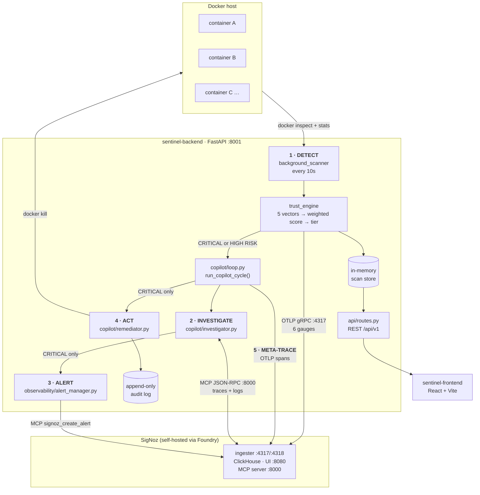

# Architecture

Sentinel Copilot is an autonomous SRE agent for Shadow AI governance. It continuously
scores every running container against five trust vectors, and for the containers that
score badly it investigates, alerts, and — only in the worst tier — kills them, while
tracing its own decision-making into SigNoz.

Every number and span name below was verified against a running stack
(SigNoz v0.134.0 + backend scanning 17 containers), not read off the design.

---

## The loop



## The five stages

### 1 · Detect

`app/scanner/background_scanner.py` polls the Docker socket every
`SCAN_INTERVAL_SECONDS` (default 10). For each running container it pulls
`docker inspect` plus a non-streaming `stats` snapshot and hands them to the trust
engine. Results land in an in-memory store keyed by container ID — this is the single
source of truth for the REST API, so request handling never touches Docker (except
the explicit kill endpoint).

The five vectors, in `app/trust_engine/vectors/`:

| Vector | Weight | What drops the score |
|---|---|---|
| `identity` | 0.25 | Image not in the sanctioned whitelist → **20**. Digest-only image (no tag) → **10** |
| `configuration` | 0.25 | Running as root −25, `--privileged` −40, read-only rootfs +15 |
| `network` | 0.15 | Port on `0.0.0.0` −15, or −25 if it is a critical port (22, 23, 2375, 2376, 5432, 3306, 6379, 27017) |
| `resources` | 0.15 | No memory limit −20, no CPU limit −15, CPU >80% −20, memory >80% −20 |
| `llm_behavior` | 0.20 | Derived from LLM telemetry found in SigNoz. Returns a neutral **100** when none exists |

`app/trust_engine/scorer.py` combines them into a weighted score and a tier. Missing
vectors have their weight redistributed proportionally.

| Tier | Score |
|---|---|
| `CRITICAL` | < 40 |
| `HIGH RISK` | 40 – 60 |
| `ELEVATED` | 60 – 80 |
| `HEALTHY` | ≥ 80 |

### 2 · Investigate

For `CRITICAL` **or** `HIGH RISK`, `copilot/loop.py` runs the Investigator. It picks the
lowest-scoring vector as the primary cause, then queries SigNoz over MCP for traces and
logs matching the container name to attach supporting evidence.

Correlation is best-effort by design: a container that is not OpenTelemetry-instrumented
yields an empty evidence list and says so, rather than failing. A real result from the
demo fleet:

```json
{
  "primary_vector": "network",
  "primary_cause": "network (0/100): CRITICAL port 22→34222 exposed on 0.0.0.0 (−25); …",
  "evidence_count": 0,
  "alert_created": false
}
```

> **Requires `SIGNOZ_API_KEY`.** The MCP client refuses to construct without one, and
> `loop.py` catches the error — so the cycle still reports
> `final_action: investigated_no_kill` while the entire investigate/alert stage silently
> did nothing. If investigations look empty, check `.env` first.

### 3 · Alert

`observability/alert_manager.py` creates a SigNoz threshold alert rule on
`sentinel.container.trust_score` (`op: below`, default threshold 40) via the
`signoz_create_alert` MCP tool. It calls `signoz_list_notification_channels` first
rather than guessing a channel name.

Two deliberate constraints:

- **`CRITICAL` only.** `HIGH RISK` is investigated but never alerted.
- **The Investigator is the single authority** for firing alerts. `loop.py` never calls
  AlertManager directly, which is what stops duplicate rules being created.

### 4 · Act

`copilot/remediator.py` may autonomously `docker kill` a container — but **only** in the
`CRITICAL` tier. This is gated twice: `loop.py` will not call `remediate()` outside
CRITICAL, and `remediate()` re-checks the tier before touching Docker.

Every outcome is written to an append-only audit log, including skips, so a
non-action is as auditable as a kill:

```
remediator  sentinel-crit-test  autonomous_kill
   trust=38 [CRITICAL]: Autonomously killed — trust_score=38.0 [CRITICAL].
   Root cause: network (0/100): CRITICAL port 22→35022 exposed on 0.0.0.0 (−25); …
```

Humans keep a manual override at `POST /api/v1/containers/{id}/kill`, which is
independent of the autonomous path.

### 5 · Meta-trace

The agent instruments its own reasoning. `observability/copilot_tracer.py` opens a
`copilot_cycle` parent span per cycle with `detect`, `investigate` and `remediate` as
children, forming a waterfall in SigNoz's Trace Explorer.

Every copilot span carries `component = sentinel-copilot-brain`, which separates the
agent's decisions from ordinary API and scanner spans. Filter on that attribute to watch
the agent think. Verified present, e.g. an `investigate` span of 2.10s under
`service.name = sentinel-backend`.

---

## Observability surface

`observability/otel_setup.py` configures both providers against
`SIGNOZ_OTLP_ENDPOINT` (gRPC), with `service.name = sentinel-backend` and
`deployment.environment` from `ENVIRONMENT`. Metrics flush every 10s.

Six observable gauges (0–100, `unit: score`), each carrying `container_id`,
`container_name`, `environment` and `risk_tier`:

```
sentinel.container.trust_score
sentinel.container.vector.identity
sentinel.container.vector.configuration
sentinel.container.vector.network
sentinel.container.vector.resources
sentinel.container.vector.llm_behavior
```

`risk_tier` is emitted as an attribute so dashboards can group by the scorer's own
classification instead of re-deriving buckets from the score. Two SigNoz dashboards are
committed as JSON in [signoz-dashboards/](signoz-dashboards/).

## API surface

All under `/api/v1` (`app/api/routes.py`):

| Endpoint | Purpose |
|---|---|
| `GET /containers` | All scanned containers with vector scores and reasons |
| `GET /containers/{id}` | One container's full breakdown |
| `POST /containers/{id}/kill` | Manual kill switch (human-triggered) |
| `GET /containers/{id}/investigation` | Run an Investigator pass on demand |
| `POST /containers/{id}/run-copilot-cycle` | Run the whole cycle on demand — the demo trigger |
| `GET /metrics/summary`, `/metrics/cost` | Executive and cost aggregates |
| `GET /discovery/shadow-ai` | Container discovery, shaped for the frontend |
| `GET /security/alerts` | Alerts derived from CRITICAL/HIGH RISK containers |
| `GET /governance/audit-logs` | Remediator audit trail |
| `GET /system/health` | Fleet health summary |

## Ports

| Port | Service |
|---|---|
| 8001 | Sentinel backend (FastAPI) |
| 8080 | SigNoz UI + API |
| 4317 / 4318 | SigNoz OTLP ingest (gRPC / HTTP) |
| 8000 | SigNoz **MCP server** — not the backend |
| 5173 | Frontend dev server (Vite default) |

> The frontend defaulted to `:8000` for a while, which is the MCP server, so every
> dashboard read from the wrong service. If the UI is empty, check `VITE_API_URL`.

---

## Known limitations

Stated plainly, because a governance tool that overstates itself is worse than useless.

- **No persistence.** The scan store and audit log are in-memory. A backend restart
  loses all history; only what reached SigNoz survives.
- **Cost figures are not measured.** `/metrics/cost` and `metrics/summary.money_saved`
  derive from a hardcoded `$300/container` model in `routes.py`. These are **not** real
  spend, are marked "Demo Data" in the UI, and should not be quoted as savings. The
  SigNoz Cost Intelligence dashboard deliberately omits any cost-per-day panel for this
  reason.
- **`llm_behavior` is usually unmeasured.** With no LLM telemetry it returns a neutral
  100, so a fleet of 100s means "not measured", not "well behaved".
- **`CRITICAL` is hard to reach from configuration alone.** Because `llm_behavior`'s
  neutral 100 contributes a fixed 20 points, the worst realistic misconfiguration lands
  around 41–43. Reaching CRITICAL needs a digest-only image plus sustained resource
  abuse, or genuine LLM findings. See [DEMO_SCRIPT.md](DEMO_SCRIPT.md) for a verified
  recipe.
- **Scanning is serial.** Each container costs roughly 2s of mostly-blocking Docker I/O,
  so a 17-container fleet takes ~35s per cycle and API latency suffers. Fine for a demo,
  not for a large fleet.
- **Authentication is mocked.** There is no auth backend; the frontend's SSO is a stub.

## Repository layout

```
sentinel-backend/app/
  api/routes.py              REST API
  core/                      config, docker_bridge
  trust_engine/
    vectors/                 identity, configuration, network, resources, llm_behavior
    scorer.py                weights + tier thresholds
  scanner/background_scanner.py
  copilot/                   loop, investigator, remediator
  observability/             otel_setup, metrics_emitter, copilot_tracer,
                             alert_manager, mcp_client
sentinel-frontend/src/       React dashboards (Executive, Discovery, Security, Cost, Audit)
scripts/seed_demo_agents.sh  demo fleet with varied risk profiles
docs/signoz-dashboards/      exported dashboard JSON
casting.yaml                 Foundry manifest for the SigNoz stack
```
